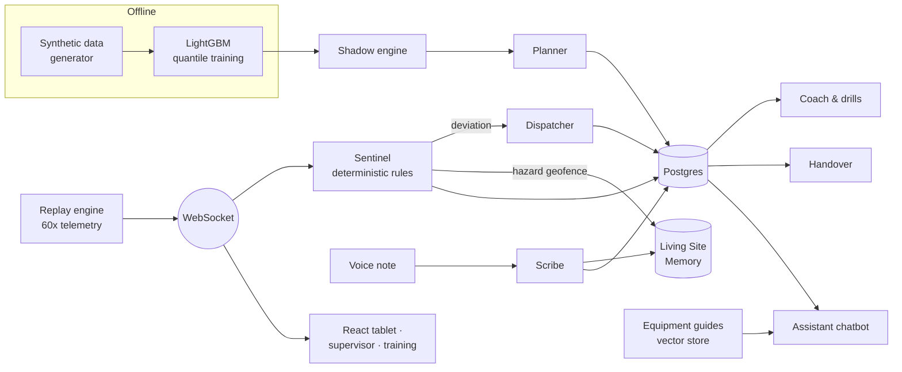

<p align="center">
  <picture>
    <source media="(prefers-color-scheme: dark)" srcset="frontend/public/cat-logo.svg" />
    
  </picture>
</p>

<h1 align="center">Shadow Shift</h1>

<p align="center">
  <b>An agentic co-pilot for CAT machine operators that runs a simulated "shadow" of every shift and acts when reality drifts from it.</b>
</p>

<p align="center">
  <a href="#quick-start">Quick start</a> ·
  <a href="#the-demo-shift">Demo walkthrough</a> ·
  <a href="#architecture">Architecture</a> ·
  <a href="#testing">Testing</a> ·
  <a href="#deployment">Deployment</a>
</p>

---

## The problem

Heavy-equipment operators work long shifts in changing conditions: wet ground, tight haul
ramps, other machines nearby, fatigue creeping in after hour six. The machines already
produce rich telemetry, but it is mostly looked at after something goes wrong. Operators
have no clear sense of whether today is going to plan. Hazards one crew finds are forgotten
by the next, and training is generic rather than based on what actually happened on shift.

## The idea

Before each shift, Shadow Shift **predicts the shift the operator is about to have**: task
times, idle windows, fuel burn, and risk points. It builds this from past telemetry, the
weather, site conditions, and the operator's own history. During the shift the real machine
runs alongside that shadow. When the two meaningfully diverge, a team of agents acts: it
prompts for safety, re-plans the task order, logs incidents from a voice note, warns other
machines, and turns the shift into targeted training.

## Features

| | Feature | What it does |
|---|---|---|
| 🔮 | **Shadow engine** | LightGBM quantile models (p10 / p50 / p90) for task time, plus regressors for idle and fuel. The p10–p90 band is conformally calibrated. |
| 🧭 | **Planner** | Scores each task's risk and writes a short pre-shift briefing. |
| 🛡️ | **Sentinel** | Deterministic safety rules on every telemetry minute: seatbelt unbuckled with the engine on, idle, cycle and fuel deviations, fatigue, and hazard geofences. **No LLM in the safety path.** |
| 😴 | **Fatigue score** | Weighted blend of hours worked, time since a break, slowdown against the operator's own baseline, and extra micro-pauses. |
| 🔀 | **Dispatcher** | Risk-aware task reordering when the shift drifts, with a one-line explanation for the operator. |
| 🎙️ | **Scribe** | A voice note becomes a structured incident report. |
| 📍 | **Living Site Memory** | Incidents become geofenced hazard pins that warn *other* approaching machines, and fade over time unless someone reconfirms them. |
| 💬 | **Assistant chatbot** | Floating, draggable widget that snaps to screen edges. It answers from live shift data and the equipment guides, and it tells the operator to stop and call the supervisor when the guides don't cover a safety question. It minimizes when an alert fires and goes voice-only while the machine works. |
| 🎓 | **Training hub** | Lessons with quizzes, a 2D joystick excavator simulator (ISO controls), an interactive pre-start walkaround, "learn from your shift" drills, Coach recommendations, and instructor booking. |
| 🧑‍💼 | **Supervisor console** | Live view of both machines, alerts, incidents, hazards, and an end-of-shift handover briefing. |

The operator tablet UI is **glove-friendly**: large touch targets, high contrast, minimal text.

## The demo shift

The demo is fully deterministic: seed 42, scripted events at fixed minutes, and a replay at
60× speed. An 8-hour shift plays out in 8 minutes at a quarry site in Anjanapura, south
Bengaluru, in wet conditions. Two machines share the site: EX-01, a CAT 320 excavator, and
WL-02, a CAT 950 wheel loader.

| Shift minute | What happens | Who acts |
|---|---|---|
| 0 | Pre-shift briefing: wet ground, ramp ditch flagged as the riskiest task | Planner |
| 2–5 | Engine on, seatbelt unbuckled → critical prompt | Sentinel |
| 150–174 | Unplanned idle on the haul ramp → idle deviation alert | Sentinel |
| same minute | Task order changed to work the stockpile and yard first, with a one-line reason | Dispatcher |
| 200 | Operator voice note: *"Ground is soft at the edge of the haul ramp, right track sank about a foot…"* → incident report + hazard pin | Scribe, Site Memory |
| 250–275 | WL-02 drives toward the ramp and is warned before it reaches the soft ground | Site Memory |
| from ~420 | Fatigue score crosses its alert level | Sentinel |
| after the shift | Drills built from the shift's own moments, Coach picks modules, handover for the next crew | Coach, Handover |

**Suggested walkthrough:** open **Tablet** and start the replay → watch the alerts land →
open **Supervisor** in a second window to see the hazard pin and the second machine's warning
→ open **Training** to try the drills generated from that shift, the joystick simulator, and
the walkaround.

## Architecture



- **Orchestration:** LangGraph wires the agents together. Sentinel runs on every minute of
  telemetry, and the other agents fire on its signals.
- **One LLM wrapper:** every OpenAI call goes through `backend/app/llm.py` and uses
  **structured outputs** with a Pydantic schema. Every agent that uses the LLM also has a
  deterministic template fallback, so the demo keeps working with no API key.
- **Safety stays deterministic:** Sentinel rules, geofence checks, and the fatigue score are
  plain Python with fixed thresholds, never an LLM call.
- **Cached demo outputs:** a read-through cache replays the demo's briefing, replan note,
  incident report, and drills, so a live demo costs nothing and gives the same result every time.

## Shadow engine results

Backtest on the most recent 20% of synthetic shifts (seed 42, 1,798 train / 456 test tasks):

| Metric | Value |
|---|---|
| Task time MAE (p50) | **5.8 min** vs 12.8 min for a median baseline (**−55%**) |
| p10–p90 band coverage | **77%** (target 80%) |
| Idle-time MAE | 1.2 min |
| Fuel MAE | 1.9 L |

`python ml/train.py` rewrites these into `ml/models/metrics.json`.

## Tech stack

| Layer | Tools |
|---|---|
| Backend | Python 3.11, FastAPI, WebSockets, SQLAlchemy, LangGraph |
| ML | LightGBM, pandas, scikit-learn, NumPy |
| LLM | OpenAI API with structured outputs (`gpt-4o-mini`, Whisper, `text-embedding-3-small`) |
| Database | Postgres (Docker locally, Neon in production) |
| Frontend | React + Vite, Tailwind CSS, react-leaflet |
| Tests | pytest, Vitest + React Testing Library |
| Deploy | Render (backend), Vercel (frontend) |

## Quick start

**Prerequisites:** Python 3.11, Node 18+, Docker.

```bash
# 1. database
docker compose up -d db

# 2. backend
cd backend
python -m venv .venv && source .venv/bin/activate   # Windows: .venv\Scripts\activate
pip install -r requirements.txt
cp ../.env.example .env                             # add OPENAI_API_KEY (optional, see below)
python data/generate.py --seed 42
python ml/train.py
uvicorn app.main:app --reload                       # http://localhost:8000

# 3. frontend (new terminal)
cd frontend
npm install
npm run dev                                         # http://localhost:5173
```

**No OpenAI key?** Everything still runs. The agents fall back to deterministic templates and
guide search falls back to keyword (BM25) scoring. Safety logic never needed the LLM anyway.

### Environment variables

| Variable | Where | Purpose |
|---|---|---|
| `OPENAI_API_KEY` | backend | OpenAI access (optional locally) |
| `DATABASE_URL` | backend | Postgres URL. Neon-style `postgres://` URLs are accepted. |
| `FRONTEND_ORIGIN` | backend | Comma-separated allowed origins (CORS and WebSocket) |
| `FRONTEND_ORIGIN_REGEX` | backend | Optional extra origins, e.g. Vercel preview deploys |
| `LLM_CACHE` | backend | `read` (default), `record`, or `off` |
| `VITE_API_URL` | frontend | Backend base URL |

## Testing

The project was built one feature at a time: each feature ships with unit tests, and each
phase closes with an integration test.

```bash
cd backend
pytest tests/unit                  # 229 tests, no network, no database
docker compose up -d db
pytest tests/integration           # phases 0–4 against Docker Postgres

cd frontend
npm test                           # 99 tests (Vitest + React Testing Library)
```

- Unit tests never call OpenAI (a `FakeLLM` replaces the wrapper) and never need a live database.
- Integration tests use Docker Postgres and are still fully mocked, so they are free and deterministic.
- Every test uses seed 42.

| Phase | Integration check |
|---|---|
| 0 | App starts, connects to the DB, creates tables, health is OK |
| 1 | Generated data trains the models, predictions return a valid range, and replay streams in order |
| 2 | The demo triggers the seatbelt prompt, idle alert, replan, and a stored incident at the scripted minutes |
| 3 | A hazard from one machine warns the other, the chatbot uses live shift data, and the Coach matches recorded behavior |
| 4 | The full demo shift runs on a production-configured backend: Neon-style URL, deployed origin, cached LLM |

## Deployment

The repo includes deployment config; nothing is deployed automatically.

**Backend → Render.** `render.yaml` is a blueprint. It installs dependencies, generates the
seed-42 data, trains the models during the build (about 10 s), and serves with uvicorn on
`$PORT` with `/health` as the health check. Set `OPENAI_API_KEY`, `DATABASE_URL` (Neon), and
`FRONTEND_ORIGIN` in the Render dashboard.

**Frontend → Vercel.** Set the project root to `frontend/` and set `VITE_API_URL` to the Render
URL. `vercel.json` rewrites client routes to `index.html`, so deep links like `/training` work.

**Record the demo cache (optional, once):** with a key in `backend/.env`, run
`python -m app.record_cache`. It plays the whole demo shift once and writes every LLM output
to `backend/data/llm_cache.json`. Commit that file, and every later demo run replays it with
no API calls.

**Verify the deploy:**

```bash
DEPLOYED_API_URL=https://<your-app>.onrender.com \
DEPLOYED_FRONTEND_ORIGIN=https://<your-app>.vercel.app \
pytest tests/integration/test_phase_4.py
```

## Repository layout

```
├── backend/
│   ├── app/
│   │   ├── main.py            FastAPI routes + telemetry WebSocket
│   │   ├── llm.py             the single OpenAI wrapper (+ FakeLLM, CachedLLM)
│   │   ├── graph.py           LangGraph orchestration
│   │   ├── agents/            planner, sentinel, fatigue, dispatcher, scribe,
│   │   │                      coach, drills, handover, assistant
│   │   ├── shadow/            model loading, prediction, ahead/behind tracking
│   │   ├── site_memory.py     hazard pins, geofence, decay
│   │   ├── retrieval.py       guide vector store (embeddings + BM25)
│   │   └── replay.py, hub.py  60x replay shared by all clients
│   ├── data/generate.py       synthetic history + scripted demo shift
│   ├── ml/train.py            quantile training + backtest
│   ├── guides/                9 equipment and safety guides (markdown)
│   └── tests/                 unit/ and integration/test_phase_N.py
├── frontend/src/
│   ├── pages/                 Tablet, Training, Supervisor
│   └── components/            SiteMap, ChatWidget, JoystickSim, Walkaround, ...
├── render.yaml
└── docker-compose.yml
```

## Responsible design

- **The LLM never makes a safety call.** It writes briefings, explanations, reports, and
  drills. Alerts come from fixed rules that can be audited.
- **No guessing on safety questions.** The assistant answers only from the equipment guides.
  If they don't cover a question, it tells the operator to stop and contact the supervisor.
- **Graceful degradation.** API down, no key, or a model refusal: every agent falls back to a
  template and the shift keeps running.
- **Synthetic data only.** No real operator or machine data is used.

## Team

<!-- add team members and roles here -->

---

<sub>Built for the Caterpillar hackathon. Caterpillar, CAT, and their logos are trademarks of Caterpillar Inc.</sub>
